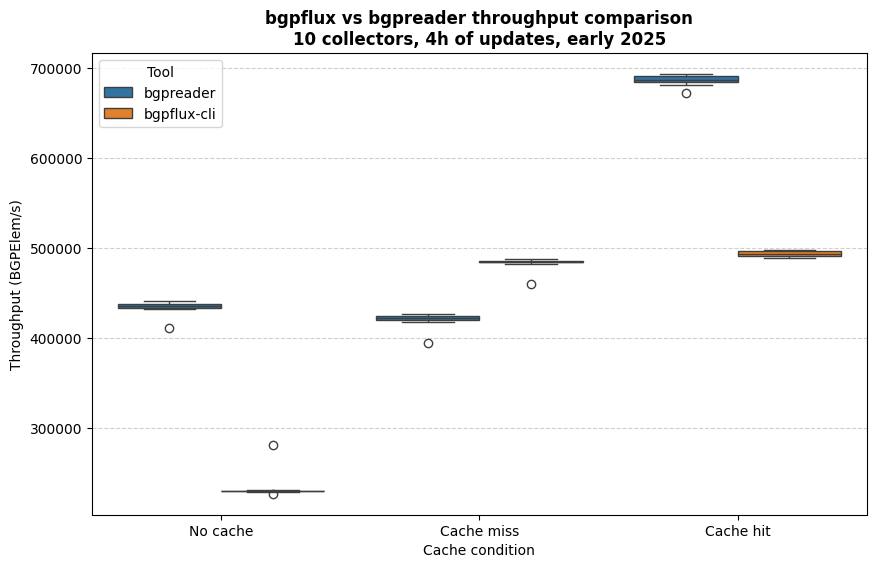

# bgpflux performance

## bgpflux-cli vs bgpreader

This benchmark demonstrates that bgpflux-cli throughput is comparable to bgpreader.  

**Benchmark Setup**
- Dataset: 4 hours of historical data from early 2025 across 10 collectors.
- Methodology: Each command was piped to wc -l to measure record throughput.
- Execution: Benchmarks were performed using hyperfine with 10 runs per command.

